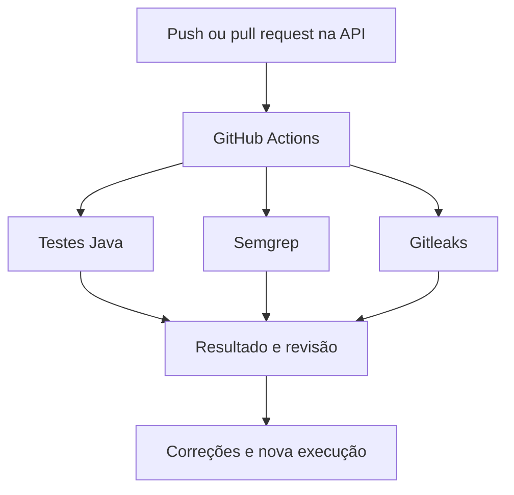
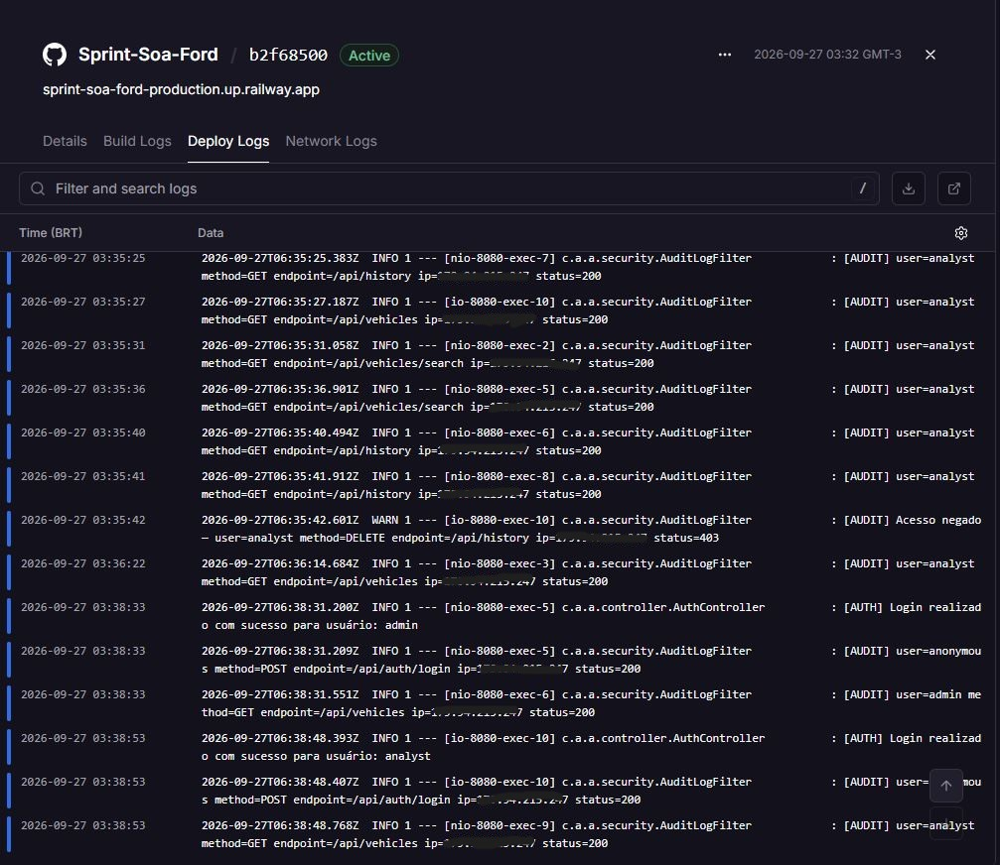
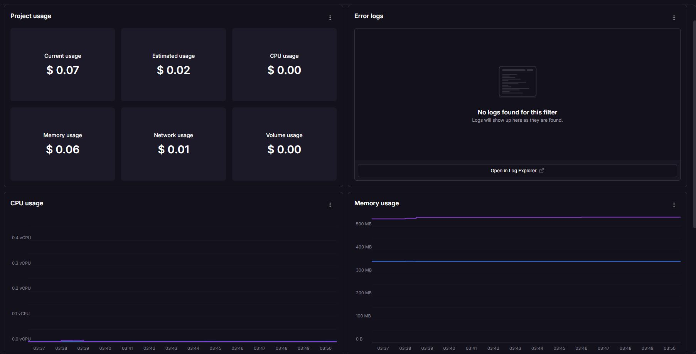

# AutoInsight — Sprint 3 de Cybersecurity

Documentação e evidências de Cybersecurity do Challenge Ford FIAP 2026.

## Equipe

| Nome | RM |
|---|---|
| Ali Andrea Mamani Molle | 558052 |
| Guilherme Linard F. R. Gozzi | 555768 |
| Lucas Vasquez Silva | 555159 |

## Repositórios e aplicação

| Recurso | Link |
|---|---|
| Código atualizado da API | [Sprint-Soa-Ford](https://github.com/AliAndrea1/Sprint-Soa-Ford) |
| Aplicativo mobile | [fiap-mdi-sprint-autoinsight](https://github.com/AliAndrea1/fiap-mdi-sprint-autoinsight) |
| Documentação interativa da API | [Swagger UI](https://sprint-soa-ford-production.up.railway.app/swagger-ui.html) |
| Pipeline de segurança | [Execução aprovada no GitHub Actions](https://github.com/AliAndrea1/Sprint-Soa-Ford/actions/runs/36296251088) |

Este repositório reúne a análise e as evidências de Cybersecurity. A implementação atual da API é mantida no repositório **Sprint-Soa-Ford**.

## Escopo e estado da entrega

A API AutoInsight foi desenvolvida em Spring Boot, utiliza MySQL no Railway e é consumida pelo aplicativo Android por HTTPS.

Na [execução do pipeline de 27/09/2026](https://github.com/AliAndrea1/Sprint-Soa-Ford/actions/runs/36296251088), passaram os testes Java, a análise estática com Semgrep e a verificação de segredos com Gitleaks. O deploy do Railway também apresentou sucesso nessa execução. As pendências de segurança indicadas neste documento ainda precisam ser tratadas e comprovadas separadamente.

## 1. Pipeline DevSecOps

O [workflow de segurança](https://github.com/AliAndrea1/Sprint-Soa-Ford/blob/master/.github/workflows/security.yml) está no repositório da API e executa em `push`, `pull_request` e por acionamento manual. A [configuração do Dependabot](https://github.com/AliAndrea1/Sprint-Soa-Ford/blob/master/.github/dependabot.yml) verifica atualizações de dependências Maven e GitHub Actions.

| Verificação | O que faz | Risco abordado | Evidência |
|---|---|---|---|
| Testes Java | Executa testes de autenticação, JWT, serviço de veículos, erros e permissões | Regressões nas regras de negócio e no controle de acesso | [Execução aprovada](https://github.com/AliAndrea1/Sprint-Soa-Ford/actions/runs/36296251088) |
| Semgrep | Analisa estaticamente o código Java | Padrões de implementação inseguros cobertos pelas regras utilizadas | [Job do Semgrep](https://github.com/AliAndrea1/Sprint-Soa-Ford/actions/runs/36296251088/job/108555535038) |
| Gitleaks | Examina o histórico Git em busca de segredos identificáveis | Exposição de credenciais detectáveis pelas regras da ferramenta | [Job do Gitleaks](https://github.com/AliAndrea1/Sprint-Soa-Ford/actions/runs/36296251088/job/108555535181) |
| Dependabot | Propõe atualizações de dependências | Uso de componentes desatualizados | [Configuração do Dependabot](https://github.com/AliAndrea1/Sprint-Soa-Ford/blob/master/.github/dependabot.yml) |

O Dependabot abre propostas de atualização, mas elas devem ser avaliadas antes do merge. Uma atualização de versão principal, como Spring Boot 3 para 4, pode exigir alterações no projeto e novos testes.

**Limite atual:** o sucesso dos jobs não garante, sozinho, que todo o código é seguro. Ainda é necessário revisar achados não detectados pelas ferramentas, proteger a branch e confirmar como o deploy do Railway é liberado. O workflow não impede automaticamente um deploy feito diretamente após um `push`.

### Evidência visual do pipeline

## 2. Segurança do código e da infraestrutura

| Controle | Onde está implementado | Como verificar |
|---|---|---|
| JWT assinado e com expiração | `JwtUtil.java` e `JwtFilter.java` | `JwtUtilTest` e `JwtFilterTest` |
| Perfis `ADMIN` e `ANALYST` | `SecurityConfig.java` | `VehicleSecurityTest`: acesso sem token, leitura permitida e escrita negada |
| Limite de requisições por IP | `RateLimitFilter.java` | Resposta HTTP 429 ao atingir o limite |
| Histórico criptografado com AES/GCM | `CryptoUtils.java` e `SearchHistoryService.java` | Conferir os dados persistidos sem expor a chave |
| Validação de entrada | DTOs e `VehicleController.java` | Enviar entradas inválidas e verificar HTTP 400 |
| HTTPS externo | Domínio público da API no Railway | Acessar a API por `https://` |

Os arquivos citados estão em [`src/main/java/com/autoinsight/autoinsight_api`](https://github.com/AliAndrea1/Sprint-Soa-Ford/tree/master/src/main/java/com/autoinsight/autoinsight_api). Os testes estão em [`src/test/java`](https://github.com/AliAndrea1/Sprint-Soa-Ford/tree/master/src/test/java).

### Pendências prioritárias

O `AuthController` passou a ler as senhas das variáveis `ADMIN_PASSWORD` e `ANALYST_PASSWORD`. Os valores padrão de `DB_PASSWORD`, `JWT_SECRET` e `CRYPTO_KEY` foram retirados do `application.properties`. As variáveis necessárias foram configuradas no Railway, e os dois perfis tiveram o login testado no aplicativo após o deploy. O `CryptoUtils` passou a interromper a operação quando a criptografia falha; o `CryptoUtilsTest` verifica que não há retorno em texto aberto. A execução local reportou 19 testes aprovados. Consulte [código e testes da API](https://github.com/AliAndrea1/Sprint-Soa-Ford).

A chave JWT foi renovada. A chave AES do histórico permanece compatível com os registros existentes; sua troca exige migração planejada dos dados. Ainda falta verificar backup e restauração e reavaliar a proteção da branch e o armazenamento do token no aplicativo.

Tokens, senhas e chaves não devem aparecer nos prints de evidência.

## 3. Observabilidade e resposta a incidentes

O `AuthController` registra tentativas de login bem-sucedidas e malsucedidas. O `AuditLogFilter` registra usuário, método HTTP, endpoint, IP, status da resposta e horário. Respostas 401 e 403 também recebem destaque nos logs.

Esses registros ajudam na investigação, mas **logs não equivalem a um painel com alertas configurados**. Ainda é necessário comprovar quais métricas e alertas estão disponíveis e ativos na infraestrutura utilizada.

| Sinal a acompanhar | Possível significado | Ação inicial |
|---|---|---|
| Muitas respostas 401 | Tentativas de autenticação inválidas | Verificar origem, volume e horário |
| Muitas respostas 403 | Tentativas de acessar funções sem permissão | Conferir conta e endpoint envolvidos |
| Aumento de respostas 429 | Volume de requisições acima do limite | Investigar origem e impacto |
| Aumento de respostas 5xx | Falha da API ou de uma dependência | Consultar logs da aplicação e do banco |
| API indisponível | Interrupção do serviço | Verificar o deploy e a infraestrutura |

### Evidência dos logs

### Dashboard de infraestrutura

O painel Metrics do Railway acompanha o consumo de CPU, memória e rede
do serviço da API. Os logs de autenticação e auditoria complementam esses
gráficos na investigação de incidentes.

O painel acima apresenta métricas de infraestrutura; taxas de erro e latência da aplicação exigem instrumentação ou análise específica dos logs. A configuração de alertas ainda precisa ser comprovada.

### Fluxo de resposta a incidentes

1. **Detecção:** identificar alerta, erro ou comportamento anormal.
2. **Análise:** reunir horário, endpoints afetados, logs e impacto, sem copiar tokens ou senhas para a documentação.
3. **Contenção:** restringir o acesso afetado ou revogar credenciais comprometidas.
4. **Erradicação:** corrigir a causa no código ou na configuração.
5. **Recuperação:** restaurar o serviço e testar novamente a API e os fluxos do aplicativo.
6. **Registro:** documentar a causa, a solução e as ações para evitar recorrência.

Backup do MySQL e teste de restauração precisam de evidência própria antes de serem apresentados como controles concluídos.

## 4. Análise de riscos e conformidade

### Modelo STRIDE

| Categoria | Cenário no AutoInsight | Controle existente ou ação necessária |
|---|---|---|
| Spoofing | Uso indevido de conta ou token | JWT; senhas por variáveis de ambiente e revisão periódica de acessos |
| Tampering | Alteração indevida de veículo | Escrita restrita a `ADMIN`; testar e auditar operações |
| Repudiation | Usuário negar uma operação realizada | Trilha de auditoria; proteger acesso e retenção dos logs |
| Information disclosure | Exposição de segredos, token ou histórico | Gitleaks, revisão de segredos e armazenamento do token |
| Denial of service | Excesso de requisições | Rate limiting; verificar comportamento atrás do proxy |
| Elevation of privilege | `ANALYST` tentar executar ações de `ADMIN` | RBAC e testes de resposta 403 |

### Referências para revisão

A revisão de segurança considera os seguintes grupos de requisitos:

- **OWASP ASVS:** autenticação, gerenciamento de sessão, autorização, validação e registros de segurança.
- **OWASP API Security Top 10:** autorização por objeto e por função, consumo de recursos e configuração da API.
- **OWASP Mobile Top 10:** armazenamento local do token, comunicação com a API e segurança do aplicativo Android.

Essa relação orienta a revisão. **Ela não representa uma certificação ou conformidade integral com o ASVS.**

### Privacidade e LGPD

O projeto deve identificar quais dados pessoais aparecem nas contas, nos endereços IP e nos logs. Também precisa definir finalidade do tratamento, acesso mínimo, retenção e procedimento de exclusão quando aplicável.

O histórico de buscas pode revelar atividades profissionais dos usuários. O acesso ao banco e às evidências deve ser limitado. Telemetria e localização não foram confirmadas como dados coletados pelo aplicativo; devem ser analisadas caso sejam adicionadas no futuro.

## Evidências e próximos passos

| Evidência ou ação | Situação |
|---|---|
| Execução de testes Java, Semgrep e Gitleaks | [Aprovada no GitHub Actions](https://github.com/AliAndrea1/Sprint-Soa-Ford/actions/runs/36296251088) |
| Print dos checks aprovados | Incluído na seção Pipeline DevSecOps |
| Avaliação dos PRs do Dependabot | Pendente; não aceitar atualizações automaticamente |
| Correção das credenciais e valores padrão | Implementada na API; validar pelo commit e nova execução do pipeline |
| Métricas de infraestrutura e logs | Prints incluídos nas seções de observabilidade; alertas ainda pendentes |
| Backup e restauração testada | Pendente de comprovação |
