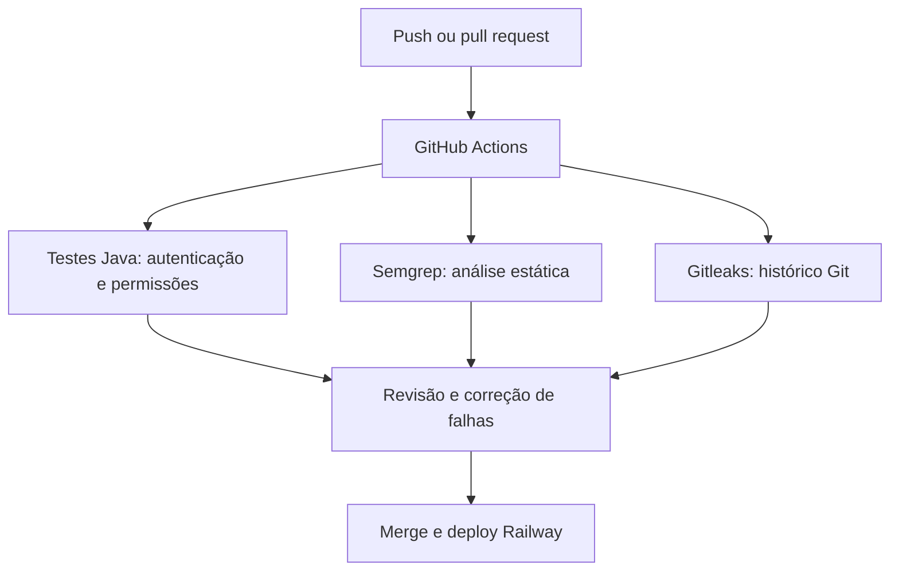

# Sprint 3 — Cybersecurity | AutoInsight

## Escopo e estado da entrega

A API Spring Boot roda no Railway com MySQL; o aplicativo Android consome a API por HTTPS. O workflow de segurança está preparado em `Sprint-Soa-Ford/.github/workflows/security.yml`. A primeira execução no GitHub, seus resultados e capturas de tela ainda precisam ser registrados antes de afirmar que o pipeline passou.

## 1. Pipeline DevSecOps

| Etapa | Implementação | Risco tratado | Evidência a guardar |
|---|---|---|---|
| Testes de API | Maven, testes de login, JWT, leitura, 401, 403, 404 e 409 | Regressões de autenticação e regras de negócio | Aba Actions, testes e resultado |
| SAST | Semgrep com regras Java e falha em achados | Padrões inseguros no código | Aba Actions, achados e correção |
| Segredos | Gitleaks no histórico completo com saída censurada | Exposição de chaves e senhas no Git | Aba Actions, resultado e revisão do histórico |
| SCA | Dependabot semanal para Maven e GitHub Actions | Dependências desatualizadas | Aba Security/Dependabot e PRs |

O workflow executa em `push` e `pull_request` das branches `master` e `main`, além de execução manual em Actions. Dependabot propõe atualizações; verificar se Dependabot alerts está habilitado no repositório. Configurar proteção da branch para exigir os três jobs antes do merge. O deploy Railway só deve ocorrer depois do merge validado; o workflow **não** configura a proteção de branch nem altera sozinho o gatilho de deploy Railway. Não há Dockerfile verificado nesta API, portanto a análise de imagem de contêiner fica condicionada à adoção de uma imagem própria.

## 2. Código e infraestrutura

| Controle observado | Código da API | Teste ou conferência |
|---|---|---|
| JWT assinado e com expiração | `security/JwtUtil.java`, `JwtFilter.java` | `JwtUtilTest`, `JwtFilterTest` |
| Permissões ADMIN e ANALYST | `config/SecurityConfig.java` | `VehicleSecurityTest` cobre 401, leitura 200 e escrita 403 |
| Limite de 30 requisições por minuto e IP | `security/RateLimitFilter.java` | Testar 429 com carga controlada; considerar proxies Railway |
| Histórico criptografado AES/GCM | `security/CryptoUtils.java`, `service/SearchHistoryService.java` | Conferir registros do histórico sem expor chave |
| Validação de entrada | DTOs com Jakarta Validation, `VehicleController.java` | Testar entrada inválida e resposta 400 |
| HTTPS externo | Domínio público Railway | Abrir Swagger e API por `https://` |

**Pendência prioritária:** a versão consultada da API mantém `admin123` e `analyst123` no `AuthController` e valores padrão em `application.properties` para `DB_PASSWORD`, `JWT_SECRET` e `CRYPTO_KEY`. Isso impede afirmar que não há segredos no código. Trocar senhas de demonstração por credenciais configuradas com segurança, retirar os valores padrão dos segredos em produção, configurar novas variáveis no Railway e girar todas as chaves que tenham sido expostas. Chave AES alterada exige estratégia de migração dos históricos já criptografados. Evitar publicar tokens, senhas e segredos nas evidências.

## 3. Observabilidade e resposta a incidente

O `AuthController` registra login com sucesso e falha; `AuditLogFilter` registra usuário, método, rota, IP e status no banco e nos logs, com destaque para 401/403. Logs atuais não constituem, por si, dashboard ou alertas. Proposta: painel Railway com taxa de 5xx, 401/403 e 429 por janela de cinco minutos, latência da API e disponibilidade do MySQL; confirmar recursos efetivamente disponíveis no plano antes de documentar capturas. Alertas devem distinguir falhas repetidas de login, aumento de 5xx, API indisponível e falhas de conexão ao banco.

Fluxo de incidente: **detectar** alerta/log → **analisar** horário, rota, impacto e evidências sem copiar tokens → **conter** credenciais, acesso ou versão afetados → **erradicar** causa e corrigir código/configuração → **recuperar** serviço e validar testes/fluxos mobile → registrar retrospectiva e ações preventivas. Backup MySQL e teste de restauração ainda exigem comprovação específica.

## 4. Riscos, conformidade e privacidade

| Ameaça STRIDE | Cenário | Controle existente ou ação |
|---|---|---|
| Spoofing | Uso indevido de conta demo ou token | JWT e autenticação; substituir contas com senha fixa |
| Tampering | Mudança indevida em veículos | Escrita restrita a ADMIN; testar e auditar alterações |
| Repudiation | Negação de alteração feita | AuditLogFilter; proteger retenção e acesso ao log |
| Information disclosure | Chaves no repositório, JWT no AsyncStorage e histórico | Gitleaks, rotação; rever armazenamento de token no mobile |
| Denial of service | Alto volume de chamadas | Bucket4j; verificar IP de origem atrás do proxy e alertas 429 |
| Elevation of privilege | Analyst tenta escrever ou ver auditoria | RBAC e testes 403; testar endpoints restantes |

Aplicar revisão de requisitos OWASP ASVS para autenticação, sessão, autorização, validação e logs; OWASP API Security Top 10 para autorização em objetos e funções, consumo de recursos e configuração; OWASP Mobile Top 10 para armazenamento de token, transporte e build Android. Essa tabela é mapeamento inicial, **não** certificação ASVS.

LGPD: identificar dados pessoais nos campos de conta, endereço IP e logs; definir finalidade, base legal, acesso mínimo, prazo de retenção e exclusão quando aplicável. Histórico de pesquisa pode revelar atividade profissional. Documentar quem acessa o banco, política de backup, teste de restauração e procedimento de atendimento a incidente. Telemetria e localização não foram confirmadas como coletadas pelo app; avaliar apenas se forem adicionadas.

## Evidências para concluir

1. Captura dos jobs em GitHub Actions e detalhes das falhas corrigidas; guardar em `docs/evidencias/sprint3/`.
2. Captura do Dependabot habilitado e das atualizações avaliadas.
3. Commits dos controles implementados e resultado de teste dos papéis ADMIN/ANALYST.
4. Capturas dos logs/painel e demonstração de alerta, se configurado.
5. Registro de backup e restauração testada, se realizados.
